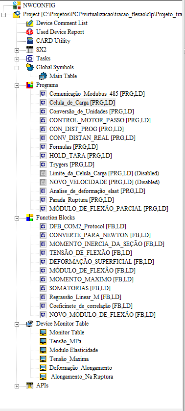

# Funcionalidades do CLP — Tração e Flexão (catálogo)

> Índice de tudo que a máquina faz, lido da árvore do projeto ISPSoft (CPU **DVP-SX2**).
> Cada item vira um `.md` próprio (a partir do [`_TEMPLATE.md`](_TEMPLATE.md)) conforme
> a gente for documentando/testando. Status: ⬜ a documentar · 🟡 em andamento · ✅ pronto.

## Programas (Ladder)

| POU | Papel (resumo) | Doc | Status |
|-----|----------------|-----|:------:|
| `Comunicação_Modbus_485` | Comunicação serial RS-485 (Modbus RTU) via COM2 | [comunicacao_485.md](comunicacao_485.md) | 🟡 |
| `Celula_de_Carga` | Leitura da célula de carga (força bruta) | [celula_de_carga.md](celula_de_carga.md) | ✅ |
| `Conversão_de_Unidades` | Converte leituras cruas → unidades de engenharia | [conversao_de_unidades.md](conversao_de_unidades.md) | ✅ |
| `CONTROL_MOTOR_PASSO` | Controle do motor de passo (movimento/velocidade) | [control_motor_passo.md](control_motor_passo.md) | ✅ |
| `CON_DIST_PROG` | Setpoints da IHM → alvos de pulso/velocidade | [con_dist_prog.md](con_dist_prog.md) | ✅ |
| `CONV_DISTAN_REAL` | Posição em pulsos → deslocamento real (mm) | [conv_distan_real.md](conv_distan_real.md) | ✅ |
| `Formulas` | Cálculos do ensaio → resultados finais | [formulas.md](formulas.md) | ✅ |
| `HOLD_TARA` | Picos (hold) e tara da célula | [hold_tara.md](hold_tara.md) | ✅ |
| `Trygers` | Gatilho de captura de pontos da curva | [trygers.md](trygers.md) | ✅ |
| `Analise_de_deformação_elast` | Troca de velocidade na região elástica | [analise_deformacao_elastica.md](analise_deformacao_elastica.md) | ✅ |
| `Parada_Ruptura` | Detecção de ruptura do corpo de prova | [parada_ruptura.md](parada_ruptura.md) | ✅ |
| `MÓDULO_DE_FLEXÃO_PARCIAL` | Módulo de flexão por regressão linear | [modulo_flexao_parcial.md](modulo_flexao_parcial.md) | ✅ |
| `Limite_da_Celula_Carga` | Alarme de sobrecarga (>75% da célula → `M21`) | — | ⬜ *(Disabled)* |
| `NOVO_VELOCIDADE` | Medição de velocidade por amostragem (timer) | — | ⬜ *(Disabled)* |

## Function Blocks (cálculo)

| FB | Papel | Doc | Status |
|----|-------|-----|:------:|
| `DFB_COM2_Protocol` | Driver do protocolo serial COM2 | — | ⬜ |
| `CONVERTE_PARA_NEWTON` | Converte leitura → Newton | — | ⬜ |
| `MOMENTO_INERCIA_DA_SEÇÃO` | Momento de inércia da seção | — | ⬜ |
| `TENSÃO_DE_FLEXÃO` | Tensão de flexão | — | ⬜ |
| `DEFORMAÇÃO_SUPERFICIAL` | Deformação superficial | — | ⬜ |
| `MÓDULO_DE_FLEXÃO` | Módulo de flexão | — | ⬜ |
| `MOMENTO_MAXIMO` | Momento máximo | — | ⬜ |
| `SOMATORIAS` | Somatórias (base da regressão) | — | ⬜ |
| `Regressão_Linear_M` | Regressão linear → coeficiente M | — | ⬜ |
| `Coeficinete_de_correlação` | Coeficiente de correlação (R) | — | ⬜ |
| `NOVO_MODULO_DE_FLEXÃO` | Nova lógica de módulo de flexão | — | ⬜ |

## Resultados do ensaio (Device Monitor Table)

Os valores finais que o operador vê — e **os principais candidatos a telemetria no MES**:

| Resultado | Unidade provável |
|-----------|------------------|
| `Tensão_MPa` | MPa |
| `Modulo Elasticidade` | MPa / GPa |
| `Tensão_Maxima` | MPa |
| `Deformação_Alongamento` | % / mm |
| `Alongamento_Na_Ruptura` | % / mm |

> Ao documentar cada item, anote os `D` correspondentes — é isso que preenche o
> [`../mapa_registradores.md`](../mapa_registradores.md) e liga a máquina ao MES.
