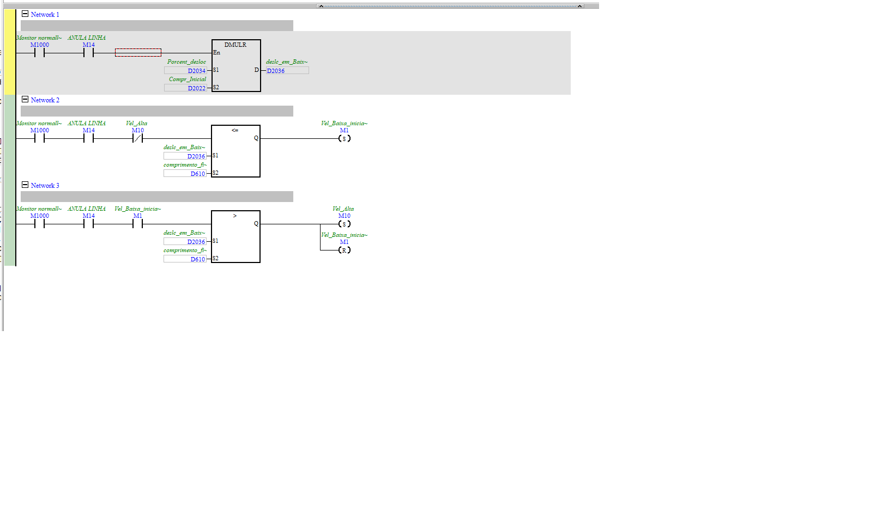

# Análise de Deformação Elástica (troca de velocidade)

| Campo | Valor |
|---|---|
| **POU no ISPSoft** | `Analise_de_deformação_elast` |
| **Tipo** | Program (LD) |
| **Estado** | Ativo |
| **Depende de** | `D2034` (%), `D2022` (L0), `D610` (compr. final) |

## 🎯 O que faz
Faz a máquina andar **devagar na região elástica** (início do ensaio, onde se mede o módulo) e
**acelerar depois**. Calcula até que deslocamento ir em baixa velocidade e alterna os bits de
velocidade.

## ⚙️ Como funciona
- **N1:** `Porcent_desloc (D2034) × Compr_Inicial (D2022) → D2036` (deslocamento em baixa vel.).
- **N2:** com `M14` (ANULA LINHA) e não-`Vel_Alta`, se `D2036 <= comprimento_final (D610)` →
  SET `Vel_Baixa_inicial` (M1).
- **N3:** se `D2036 > D610` → SET `Vel_Alta` (M10), RESET `Vel_Baixa_inicial` (M1).

## 🔢 Variáveis / registradores
| Device | Nome | Tipo | R/W MES | Observação |
|--------|------|------|:-------:|------------|
| `D2034` | Porcent_desloc | REAL | **W** | % do desloc. em baixa velocidade |
| `D2036` | deslocamento em baixa vel. | REAL | — | calculado |
| `M14` | ANULA LINHA | BIT | W? | habilita a troca de velocidade |
| `M1` | Vel_Baixa_inicial | BIT | R | fase lenta (elástica) |
| `M10` | Vel_Alta | BIT | R | fase rápida |

## 🖼️ Evidência

## ✅ Testes
| # | O que testar | Passos | Resultado esperado | Status |
|--:|--------------|--------|--------------------|:------:|
| 1 | Fase lenta na elástica | iniciar ensaio | `M1=1` até `D2036` | ⬜ |
| 2 | Acelera depois | passar de `D2036` | `M10=1`, `M1=0` | ⬜ |

## 📝 Notas
`Vel_Alta`/`Vel_Baixa` entram no controle do motor de passo (a velocidade real vai pra `D508`).
