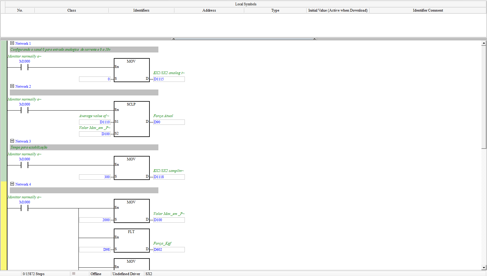
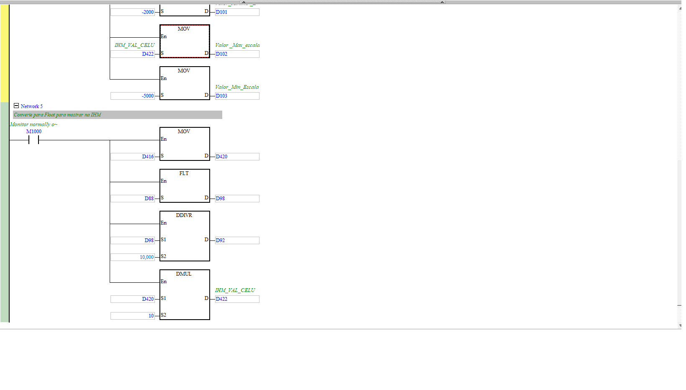

# Célula de Carga (leitura de força)

| Campo | Valor |
|---|---|
| **POU no ISPSoft** | `Celula_de_Carga` |
| **Tipo** | Program (LD) |
| **Estado** | Ativo |
| **Depende de** | módulo analógico SX2 (canal 0) |

## 🎯 O que faz
Lê a **força** do sensor (célula de carga) na entrada analógica do DVP-SX2, escala pra unidade
de engenharia e disponibiliza em kgf/Newton pro resto do programa e pra IHM.

## ⚙️ Como funciona
1. **Config do canal** — `MOV 0 → D1115` (canal 0 = entrada analógica de corrente/0–10 V);
   `MOV 300 → D1118` (tempo de estabilização/amostragem).
2. **Escala** — `SCLP` pega o valor médio (`D1110`) e escala por parâmetros (`D100`) →
   **`D90` = Força Atual**.
3. **Parâmetros de escala** — `D100=2000`, `D101=-2000`, `D102=D422` (IHM_VAL_CELU),
   `D103=-5000` definem o span.
4. **Conversão pra float (IHM)** — `FLT`/`DDIVR`/`DMUL` geram `D98`, `D92`, `D602` (Força_Kgf)
   e `D422` (valor mostrado na IHM).

## 🔢 Variáveis / registradores
| Device | Nome | Tipo | R/W MES | Observação |
|--------|------|------|:-------:|------------|
| `D90` | Força Atual | WORD | R | saída do SCLP |
| `D602` | Força_Kgf | REAL | R | força em kgf |
| `D92` | força (÷10000) | REAL | — | intermediário → vira Newton em Conversão_de_Unidades |
| `D100`–`D103` | parâmetros de escala | WORD | W? | span da célula |
| `D422` | IHM_VAL_CELU | REAL | W | calibração vinda da IHM |
| `D1115`/`D1118`/`D1110` | config/amostragem/média do canal | WORD | — | registradores especiais SX2 |

## 🖼️ Evidência

## ✅ Testes
| # | O que testar | Passos | Resultado esperado | Status |
|--:|--------------|--------|--------------------|:------:|
| 1 | Leitura escala com força 0 | simulador, forçar `D1110`=0, ler `D90` | ~0 | ⬜ |
| 2 | Força_Kgf coerente | variar entrada, ler `D602` | sobe/desce com a força | ⬜ |

## 📝 Notas
Confirmar se a entrada é corrente (4–20 mA) ou tensão (0–10 V) — o comentário cita os dois.
