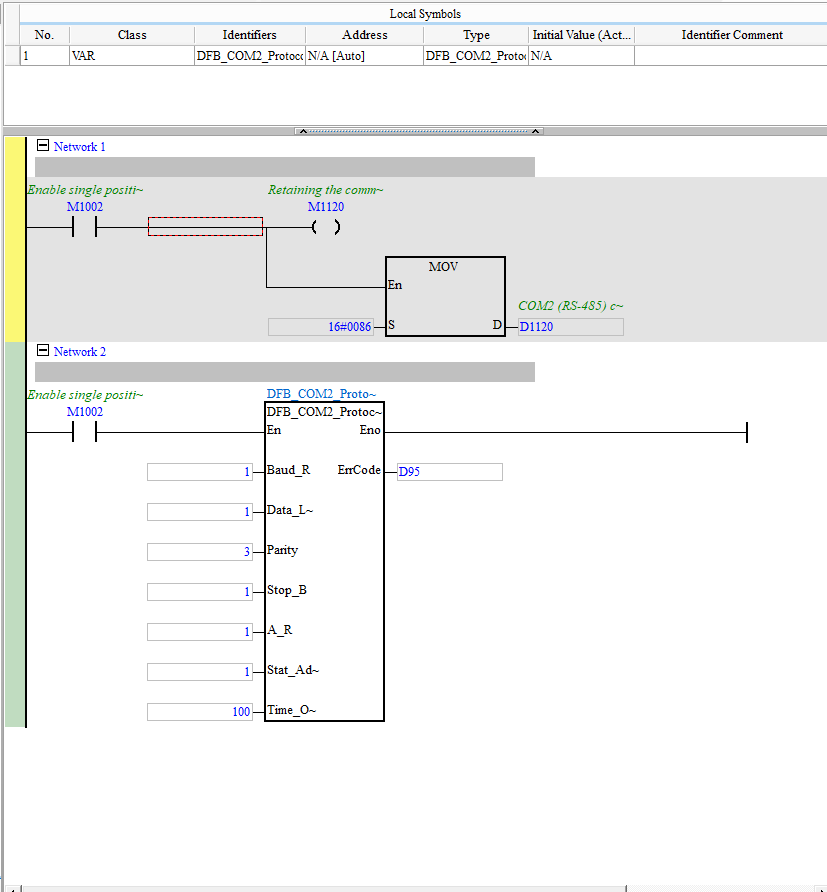

# Comunicação Modbus RS-485 (COM2)

> Convertido do Word `imagens_clp/Comunicação.docx` — serve de **exemplo do padrão**.

| Campo | Valor |
|---|---|
| **POU / FB no ISPSoft** | `Comunicação_Modbus_485` (usa o FB `DFB_COM2_Protocol`) |
| **Tipo** | Program (LD) |
| **Estado** | Ativo |
| **Depende de** | `DFB_COM2_Protocol` |

## 🎯 O que faz
Configura e mantém a comunicação **Modbus RTU sobre RS-485** na porta **COM2** do DVP-SX2.
É por aqui que o CLP troca dados com o(s) dispositivo(s) serial(is) do ensaio.

## ⚙️ Como funciona
- **Network 1:** no primeiro scan (`M1002`), com a comunicação retida (`M1120`), faz um
  `MOV 16#0086 → D1120` — grava o **modo/formato da COM2 (RS-485)** no registrador especial `D1120`.
- **Network 2:** chama o FB **`DFB_COM2_Protocol`** (habilitado por `M1002`) com os parâmetros
  de linha; o código de erro sai em **`D95`**.

## 🔢 Variáveis / registradores envolvidos

| Device | Nome | Tipo | R/W MES | Observação |
|--------|------|------|:-------:|------------|
| `D1120` | formato COM2 (RS-485) | WORD | — | registrador especial; recebe `16#0086` |
| `M1002` | pulso de primeiro scan | BIT | — | habilita a config |
| `M1120` | retenção da config COM2 | BIT | — | mantém o formato serial |
| `D95` | código de erro do protocolo | WORD | R? | diagnóstico da comunicação |

**Parâmetros do FB `DFB_COM2_Protocol`** (valores vistos no print): `Baud_R=1`, `Data_L=1`,
`Parity=3`, `Stop_B=1`, `A_R=1`, `Stat_Ad=1`, `Time_O=100`. *(Confirmar o de/para desses
códigos → baud/paridade reais.)*

## 🖼️ Evidência

## ✅ Testes
| # | O que testar | Passos | Resultado esperado | Status |
|--:|--------------|--------|--------------------|:------:|
| 1 | COM2 inicializa sem erro | Rodar no simulador, ler `D95` | `D95 = 0` (sem erro) | ⬜ |
| 2 | Formato serial gravado | Ler `D1120` após 1º scan | `D1120 = 16#0086` | ⬜ |

## 📝 Notas
- ⚠️ **Descoberta importante:** a máquina é **RS-485 (serial)**, não Modbus TCP nativo. Isso
  afeta (a) como simular expondo Modbus TCP e (b) como o MES conecta na Fase 7 (gateway
  RS485→TCP ou cliente serial). Ver `../README.md`.
- Decodificar os códigos dos parâmetros do FB (Baud_R=1 etc.) — provavelmente índices de tabela.
