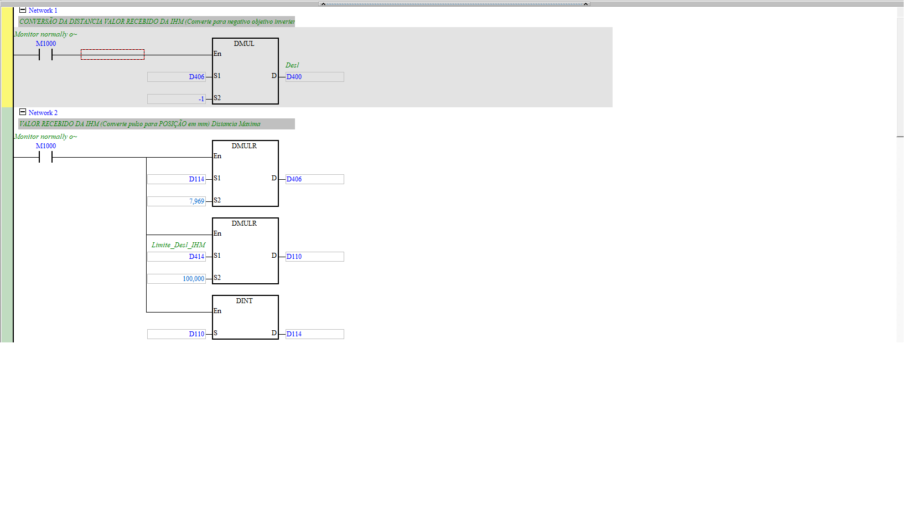
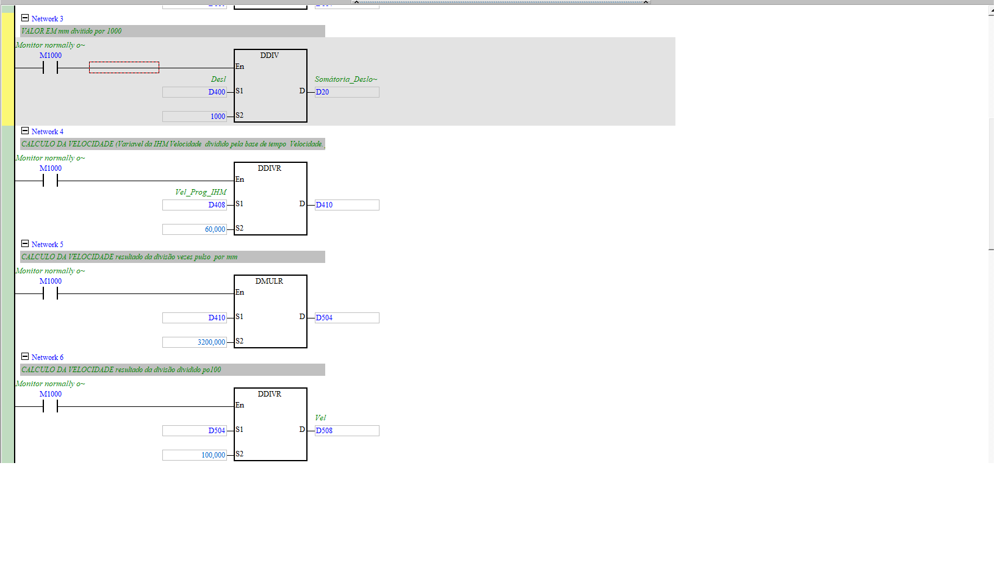
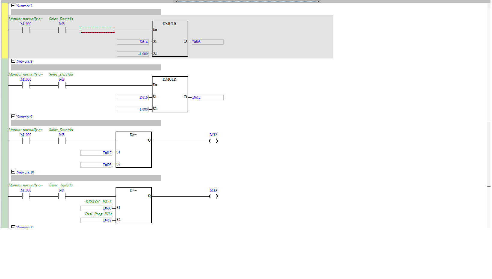
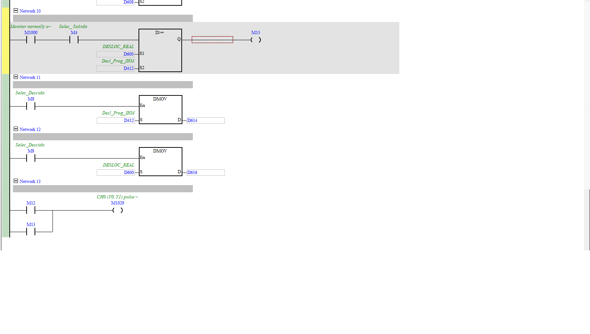

# CON_DIST_PROG (setpoints da IHM → alvos de pulso/velocidade)

| Campo | Valor |
|---|---|
| **POU no ISPSoft** | `CON_DIST_PROG` |
| **Tipo** | Program (LD) |
| **Estado** | Ativo |
| **Depende de** | valores digitados na IHM (D408/D412/D414) |

## 🎯 O que faz
Traduz o que o operador digita na IHM (deslocamento, velocidade, limite) para os valores
internos que o motor de passo usa (alvo em **pulsos** e **velocidade** em pulsos/s), e gera os
bits de "chegou no limite" que param o pulso.

## ⚙️ Como funciona
- **Deslocamento** (N1/N2): `Desl_Prog_IHM`(D412) e `Limite_Desl_IHM`(D414) convertidos por fatores
  (×7,969 ; ×100) → `D406`/`D400` (alvos em pulsos). Fator pulso↔mm ≈ **3200 pulsos/mm**.
- **Velocidade** (N4–N6): `Vel_Prog_IHM`(D408) ÷60 (base de tempo) ×3200 (pulso/mm) ÷100 → `D508` (Vel).
- **Somatória** (N3): `DDIV D400/1000 → D20` (Somatória_Deslocamento).
- **Limites** (N7–N13): compara deslocamento real com alvo (`D>=`) → `M12`/`M13` → `M1029`
  (desabilita o pulso `CH0(Y0,Y1)` quando atinge o alvo).

## 🔢 Variáveis / registradores
| Device | Nome | Tipo | R/W MES | Observação |
|--------|------|------|:-------:|------------|
| `D412` | Desl_Prog_IHM | DWORD | **W** | deslocamento alvo (mm) |
| `D408` | Vel_Prog_IHM | DWORD | **W** | velocidade programada |
| `D414` | Limite_Desl_IHM | DWORD | **W** | limite de deslocamento |
| `D400`/`D406` | alvo de pulsos (subida/descida) | DWORD | — | consumido pelo motor |
| `D508` | Vel (pulsos/s) | DWORD | — | consumido pelo motor |
| `D20` | Somatória_Deslocamento | DWORD | R? | acumulado |
| `M12`/`M13`/`M1029` | atingiu limite / desabilita pulso | BIT | — | fim de curso lógico |

## 🖼️ Evidência

## ✅ Testes
| # | O que testar | Passos | Resultado esperado | Status |
|--:|--------------|--------|--------------------|:------:|
| 1 | Setpoint vira pulso | escrever `D412`, ler `D400` | proporcional (fator ~3200/mm) | ⬜ |
| 2 | Limite para o pulso | atingir `D414` | `M12`/`M13`→`M1029` desabilita | ⬜ |

## 📝 Notas
Confirmar os fatores exatos (7,969 vs 3200) — parecem depender da mecânica (passo do fuso).
