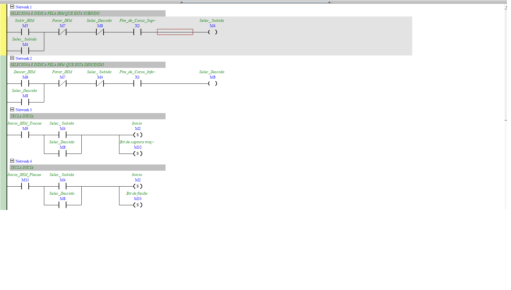
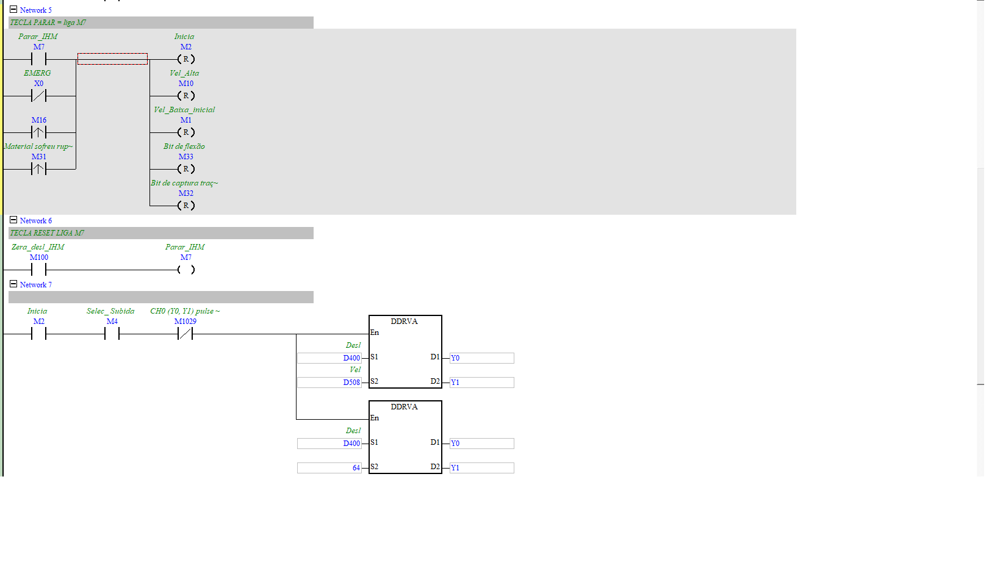
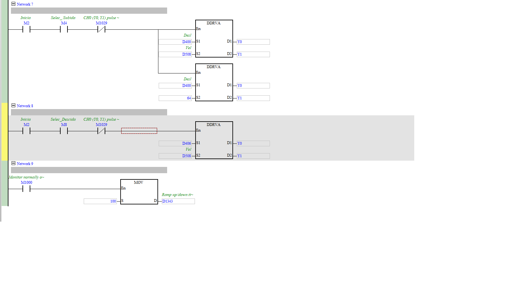

# Controle do Motor de Passo (movimento do cabeçote)

| Campo | Valor |
|---|---|
| **POU no ISPSoft** | `CONTROL_MOTOR_PASSO` |
| **Tipo** | Program (LD) |
| **Estado** | Ativo |
| **Depende de** | `CON_DIST_PROG` (fornece D400/D406/D508), fins de curso X1/X2 |

## 🎯 O que faz
Comanda o motor de passo que sobe/desce o cabeçote: seleciona direção, trata os botões da IHM
(subir/descer/parar/iniciar), emergência e ruptura, e emite os pulsos (`DDRVA` → `Y0/Y1`).

## ⚙️ Como funciona
- **Direção** (N1/N2): `Subir_IHM`/`Descer_IHM` com intertravamento e fins de curso → `Selec_Subida`(M4)/`Selec_Descida`(M8).
- **Início** (N3/N4): `Inicia_IHM_Tracao`/`Flexao` → SET `Inicia`(M2) + bit de modo (M32 tração / M33 flexão).
- **Parar/Emergência** (N5): `Parar_IHM` **ou** `EMERG`(X0) **ou** `Material sofreu ruptura`(M31) → RESET tudo.
- **Pulsos** (N7/N8): com `Inicia` e direção, `DDRVA` gera o trem de pulsos em `Y0/Y1` usando
  alvo `D400`(subida)/`D406`(descida) e velocidade `D508`. `D1343` = rampa accel/decel.

## 🔢 Variáveis / registradores
| Device | Nome | Tipo | R/W MES | Observação |
|--------|------|------|:-------:|------------|
| `M5`/`M6`/`M7` | Subir/Descer/Parar (IHM) | BIT | **W** | comandos de jog/parada |
| `M9`/`M11` | Inicia Tração / Flexão | BIT | **W** | dispara ensaio |
| `M2` | Inicia (rodando) | BIT | R | status |
| `M4`/`M8` | Selec_Subida/Descida | BIT | R | direção ativa |
| `M31` | Material sofreu ruptura | BIT | R | evento de ruptura |
| `X0`/`X1`/`X2` | Emergência / FC inferior / FC superior | BIT(X) | R | I/O físico (Fase 7) |
| `Y0`/`Y1` | pulso / direção | BIT(Y) | — | saída do motor |
| `D400`/`D406` | alvo de pulsos subida/descida | DWORD | — | vem de CON_DIST_PROG |
| `D508` | velocidade (pulsos/s) | DWORD | — | vem de CON_DIST_PROG |
| `D1343` | tempo de rampa | WORD | — | accel/decel do pulso |

## 🖼️ Evidência

## ✅ Testes
| # | O que testar | Passos | Resultado esperado | Status |
|--:|--------------|--------|--------------------|:------:|
| 1 | Jog sobe | setar `M5`, ver `Y0` pulsar e `M4=1` | cabeçote sobe | ⬜ |
| 2 | Parada por emergência | `X0=0` durante movimento | `M2` reseta, pulso para | ⬜ |
| 3 | Parada por ruptura | forçar `M31` | ensaio para | ⬜ |

## 📝 Notas
⚠️ **Segurança:** `EMERG`(X0) e fins de curso são tratados na ladder — na Fase 7 confirmar que
emergência é **também hardwired**, não só via software (NR-12).
