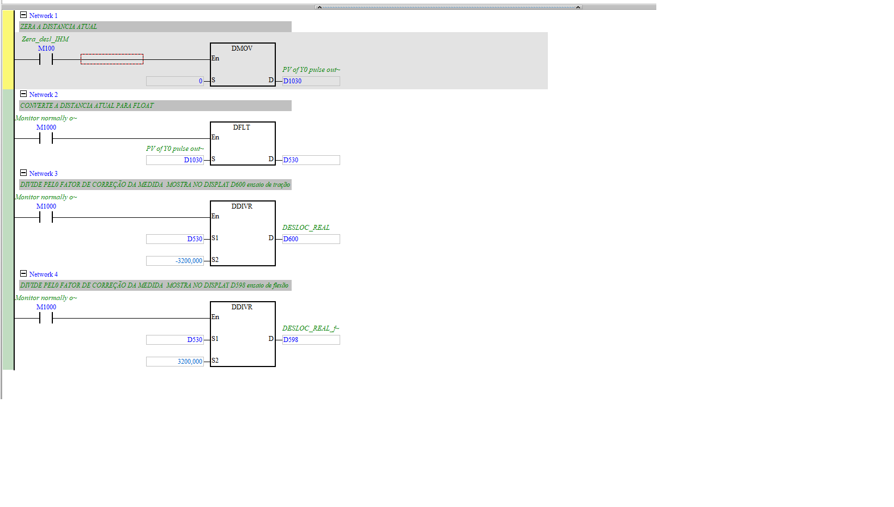

# CONV_DISTAN_REAL (posição em pulsos → deslocamento real em mm)

| Campo | Valor |
|---|---|
| **POU no ISPSoft** | `CONV_DISTAN_REAL` |
| **Tipo** | Program (LD) |
| **Estado** | Ativo |
| **Depende de** | contador de pulsos do Y0 (`D1030`) |

## 🎯 O que faz
Lê a posição atual do motor (contador de pulsos `D1030`), zera quando pedido, e converte para
**deslocamento real em mm** — separado para ensaio de tração (`D600`) e de flexão (`D598`).

## ⚙️ Como funciona
- **Zera** (N1): `Zera_desl_IHM`(M100) → `DMOV 0 → D1030` (PV do pulso Y0).
- **Float** (N2): `DFLT D1030 → D530`.
- **Tração** (N3): `DDIVR D530 ÷ -3200 → D600` (**DESLOC_REAL**), fator de correção com sinal.
- **Flexão** (N4): `DDIVR D530 ÷ 3200 → D598` (**DESLOC_REAL_flexão**).

## 🔢 Variáveis / registradores
| Device | Nome | Tipo | R/W MES | Observação |
|--------|------|------|:-------:|------------|
| `D1030` | contador de pulsos (PV Y0) | DWORD | R | posição bruta |
| `D530` | posição (float) | REAL | — | intermediário |
| `D600` | DESLOC_REAL (tração) | REAL | R | mm — telemetria |
| `D598` | DESLOC_REAL (flexão) | REAL | R | mm — telemetria |
| `M100` | Zera_desl_IHM | BIT | **W** | tara de posição |

## 🖼️ Evidência

## ✅ Testes
| # | O que testar | Passos | Resultado esperado | Status |
|--:|--------------|--------|--------------------|:------:|
| 1 | Zerar posição | setar `M100`, ler `D1030` | `D1030 = 0` | ⬜ |
| 2 | Conversão mm | mover N pulsos, ler `D600` | `≈ pulsos / 3200` | ⬜ |

## 📝 Notas
Sinal invertido entre tração (÷-3200) e flexão (÷3200) = direção de referência de cada ensaio.
