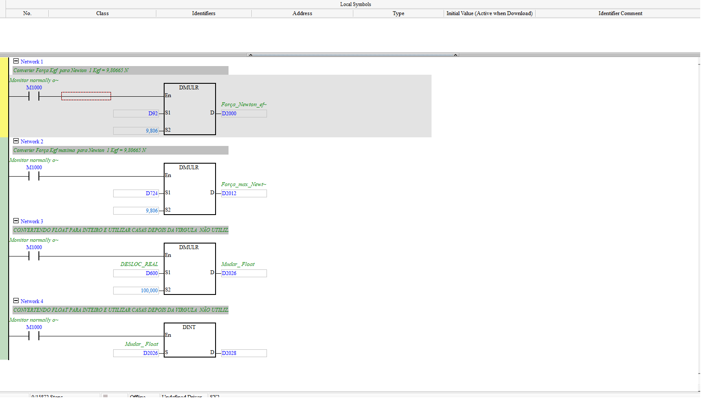

# Conversão de Unidades (kgf → Newton, escala de distância)

| Campo | Valor |
|---|---|
| **POU no ISPSoft** | `Conversão_de_Unidades` |
| **Tipo** | Program (LD) |
| **Estado** | Ativo |
| **Depende de** | `Celula_de_Carga`, `CONV_DISTAN_REAL` |

## 🎯 O que faz
Converte a força de **kgf para Newton** (1 kgf = 9,80665 N) e prepara valores de distância em
float, para alimentar as fórmulas do ensaio.

## ⚙️ Como funciona
- `DMULR D92 × 9,806 → D2000` (**Força_Newton** atual).
- `DMULR D724 × 9,806 → D2012` (**Força_max_Newton**).
- `DMULR D600 × 100 → D2026` e `DINT D2026 → D2028` (deslocamento float→int p/ casas decimais).

## 🔢 Variáveis / registradores
| Device | Nome | Tipo | R/W MES | Observação |
|--------|------|------|:-------:|------------|
| `D2000` | Força_Newton (atual) | REAL | R | entra nas fórmulas de tensão |
| `D2012` | Força_max_Newton | REAL | R | pico do ensaio |
| `D724` | Força máxima (kgf) | REAL | — | origem do pico |
| `D2026`/`D2028` | deslocamento float/int | REAL/DWORD | — | formatação de casas decimais |

## 🖼️ Evidência

## ✅ Testes
| # | O que testar | Passos | Resultado esperado | Status |
|--:|--------------|--------|--------------------|:------:|
| 1 | kgf→N | setar `D92`, ler `D2000` | `D2000 = D92 × 9,806` | ⬜ |

## 📝 Notas
`D724` (força máxima kgf) provavelmente é atualizado em outro POU (pico) — confirmar origem.
