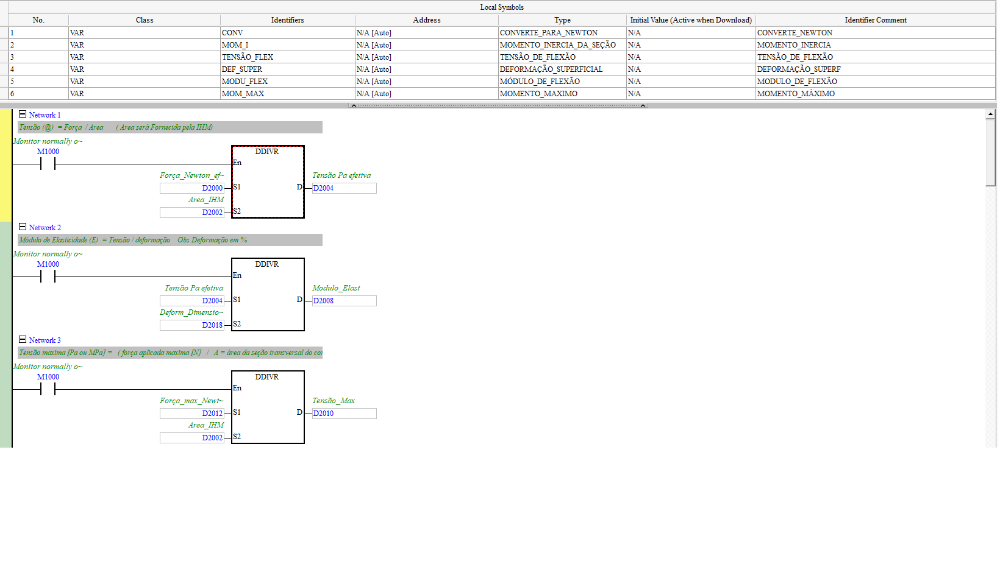
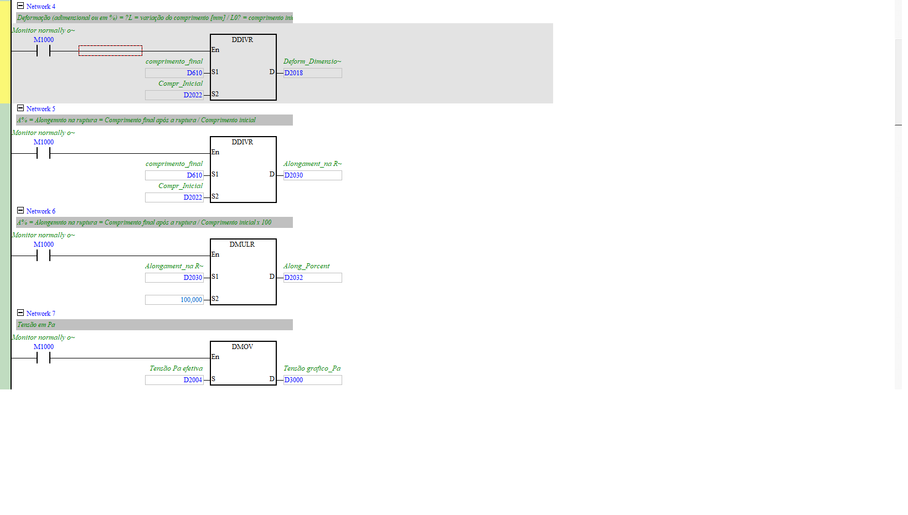
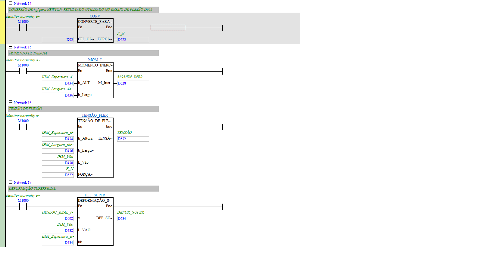
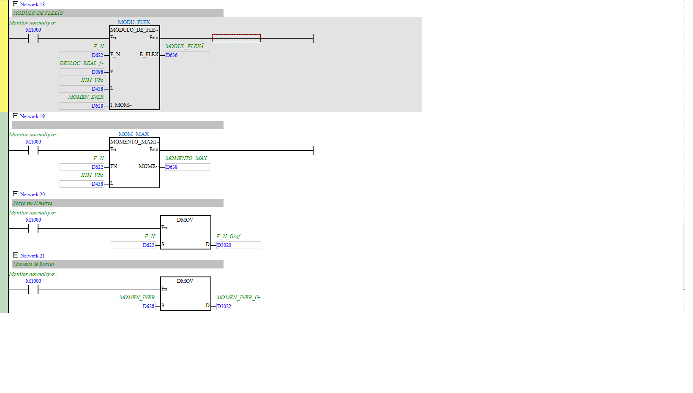
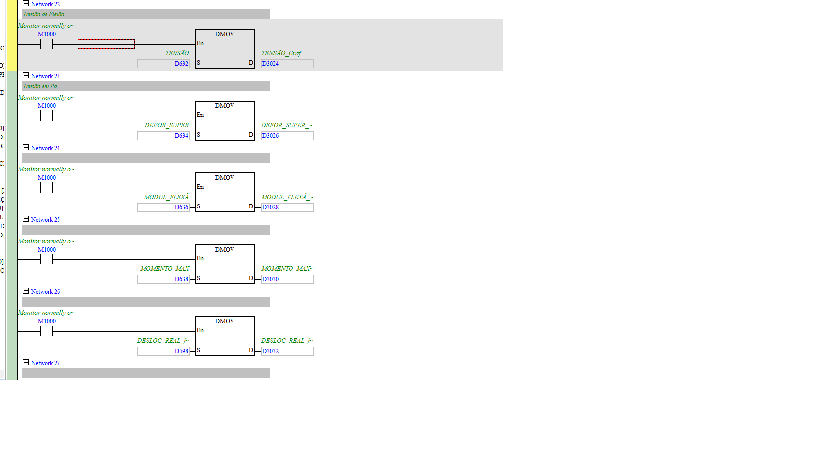

# Formulas (cálculos do ensaio → resultados finais)

| Campo | Valor |
|---|---|
| **POU no ISPSoft** | `Formulas` |
| **Tipo** | Program (LD) |
| **Depende de (FBs)** | CONVERTE_PARA_NEWTON, MOMENTO_INERCIA_DA_SEÇÃO, TENSÃO_DE_FLEXÃO, DEFORMAÇÃO_SUPERFICIAL, MÓDULO_DE_FLEXÃO, MOMENTO_MAXIMO |

## 🎯 O que faz
É o **cérebro do ensaio**: pega força e deslocamento, junta com os parâmetros do corpo de prova
(área, comprimento, dimensões) digitados na IHM e calcula todos os resultados — tensão, módulo
de elasticidade, alongamento (tração) e momento/tensão/módulo de flexão. No fim, copia tudo pros
blocos **`D3000`** (tração) e **`D3020`** (flexão), que são o que a IHM/gráfico mostram.

## ⚙️ Cálculos (tração)
| Resultado | Fórmula | Registrador |
|-----------|---------|-------------|
| Tensão | Força_N (`D2000`) ÷ Área (`D2002`) | `D2004` → gráfico `D3000` |
| Módulo Elasticidade | Tensão ÷ Deformação | `D2008` → `D3002` |
| Tensão Máxima | Força_max_N (`D2012`) ÷ Área | `D2010` → `D3004` |
| Deformação | Compr_final (`D610`) ÷ L0 (`D2022`) | `D2018` → `D3006` |
| Alongamento % | (Lf/L0) × 100 | `D2032` → `D3008` |
| Deslocamento | `D600` | → `D3010` |

## ⚙️ Cálculos (flexão) — via Function Blocks
| Resultado | FB / entradas | Registrador |
|-----------|---------------|-------------|
| Força em N | CONVERTE_PARA_NEWTON(`D92`) | `D622` → `D3020` |
| Momento de Inércia | MOMENTO_INERCIA(h=`D434`, b=`D436`) | `D628` → `D3022` |
| Tensão de Flexão | TENSÃO_DE_FLEXÃO(h,b,vão=`D438`,F=`D622`) | `D632` → `D3024` |
| Deformação Superficial | DEFORMAÇÃO_SUPERFICIAL(v=`D598`,L=`D438`,h=`D434`) | `D634` → `D3026` |
| Módulo de Flexão | MÓDULO_DE_FLEXÃO(F,v,L,I) | `D636` → `D3028` |
| Momento Máximo | MOMENTO_MAXIMO(F,L) | `D638` → `D3030` |
| Deslocamento (flexão) | `D598` | → `D3032` |

## 🔢 Entradas da IHM (setpoints do corpo de prova)
| Device | Nome | Ensaio |
|--------|------|--------|
| `D2002` | Área da seção | tração |
| `D2022` | Comprimento inicial (L0) | tração |
| `D610` | Comprimento final | tração |
| `D434` | Espessura/altura (h) | flexão |
| `D436` | Largura (b) | flexão |
| `D438` | Vão (L) | flexão |

> **Todos os `D3000`/`D3020` são REAL (2 registradores).** São os principais candidatos a
> telemetria em `tb_registrador`. Ver [`../mapa_registradores.md`](../mapa_registradores.md).

## 🖼️ Evidência

## ✅ Testes
| # | O que testar | Passos | Resultado esperado | Status |
|--:|--------------|--------|--------------------|:------:|
| 1 | Tensão = F/A | setar `D2000`,`D2002`, ler `D3000` | bate com a conta | ⬜ |
| 2 | Alongamento % | setar `D610`,`D2022`, ler `D3008` | (Lf/L0)×100 | ⬜ |
| 3 | Módulo de flexão | preencher dims flexão, ler `D3028` | valor plausível | ⬜ |

## 📝 Notas
Cada FB (TENSÃO_DE_FLEXÃO etc.) merece um doc próprio quando você printar o interior deles.
