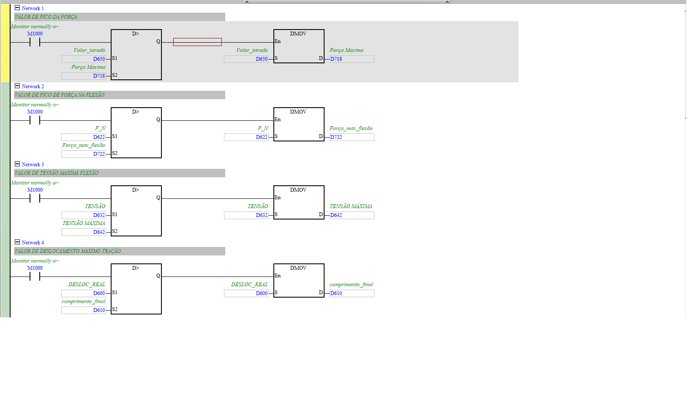
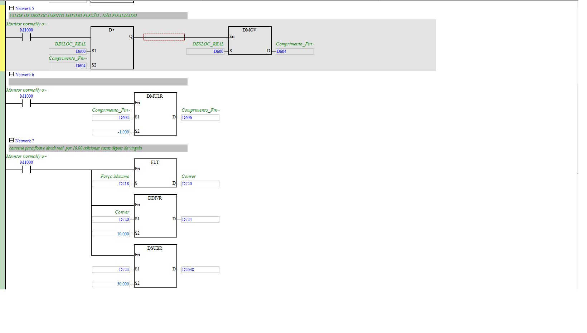
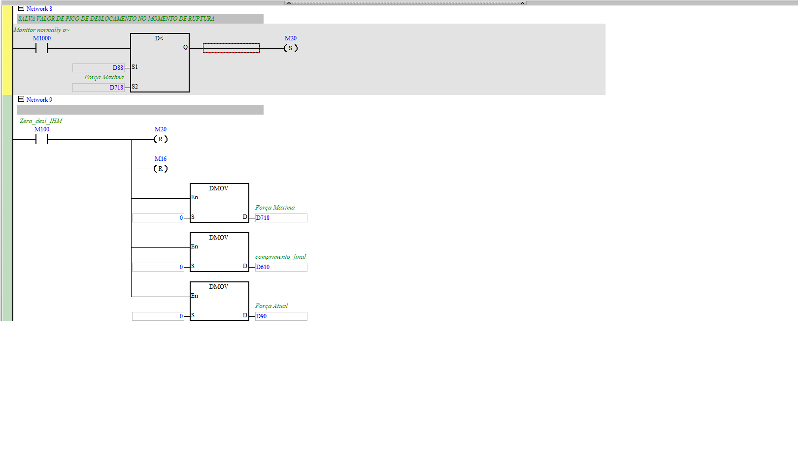
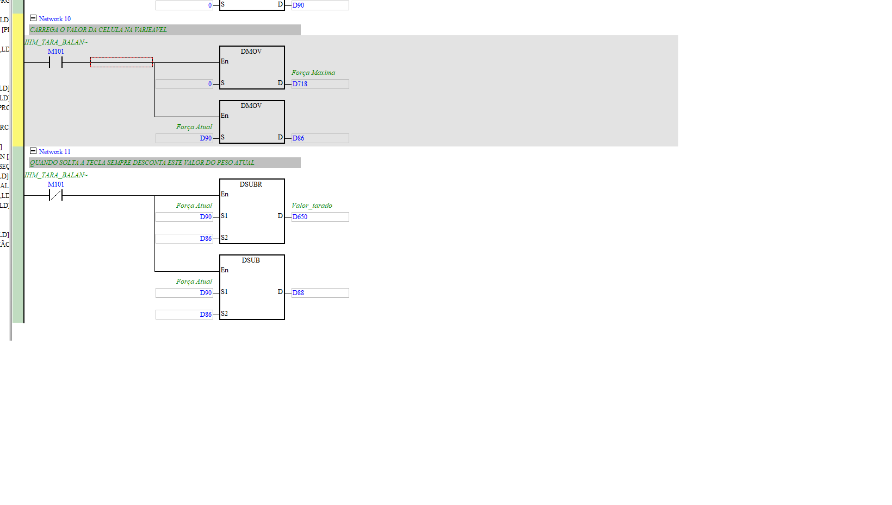

# HOLD_TARA (picos do ensaio e tara da célula)

| Campo | Valor |
|---|---|
| **POU no ISPSoft** | `HOLD_TARA` |
| **Tipo** | Program (LD) |
| **Estado** | Ativo |
| **Depende de** | `Celula_de_Carga` (D90), `CONV_DISTAN_REAL` (D600), `Formulas` (D632) |

## 🎯 O que faz
Duas funções: (1) **captura os picos** (hold) de força, tensão e deslocamento ao longo do ensaio;
(2) **tara** (zera) a leitura da célula quando o operador aperta a tecla de tara.

## ⚙️ Como funciona
**Picos (retém o máximo):** comparações `D>` com `DMOV` — se o valor atual > pico guardado, atualiza:
- Força → `D718` (Força Máxima); Força flexão → `D722`; Tensão flexão → `D642`;
- Deslocamento tração → `D610`; deslocamento flexão → `D604` (→ `D606 = ×-1`).
- `FLT`/`DDIVR`/`DSUBR` geram `D720`/`D724`/`D2038` (força máx formatada).

**Tara:**
- N10 (`M101` IHM_TARA_BALAN): guarda a força atual `D90` em `D86` e zera `D718`.
- N11 (solta a tecla, `M101` NC): `Força Atual − D86` → `D650` (Valor_tarado) e `→ D88`.
  Ou seja, todo valor passa a descontar a tara.

**Reset (N9):** `Zera_desl_IHM` (M100) zera picos (`D718`, `D610`, `D90`) e bits M20/M16.

## 🔢 Variáveis / registradores
| Device | Nome | Tipo | R/W MES | Observação |
|--------|------|------|:-------:|------------|
| `D718` | Força Máxima (pico) | REAL | R | telemetria |
| `D722`/`D642` | pico força/tensão flexão | REAL | R | |
| `D610` | Deslocamento máx (tração) | REAL | R | = comprimento final |
| `D650` | Valor_tarado | REAL | R | força já com tara |
| `D86` | offset de tara | REAL | — | valor descontado |
| `M101` | IHM_TARA_BALAN | BIT | **W** | comando de tara |

## 🖼️ Evidência

## ✅ Testes
| # | O que testar | Passos | Resultado esperado | Status |
|--:|--------------|--------|--------------------|:------:|
| 1 | Pico de força | variar força, ler `D718` | retém o máximo | ⬜ |
| 2 | Tara | aplicar carga, pulsar `M101` | `D650` passa a descontar o valor | ⬜ |

## 📝 Notas
`D718` (pico) e `D650` (tarado) são bons candidatos a telemetria no MES.
