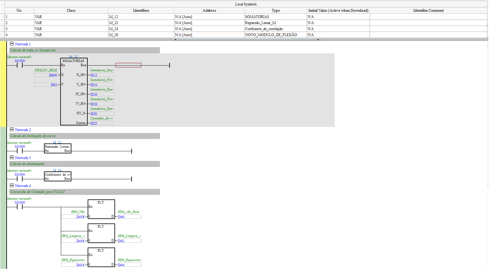
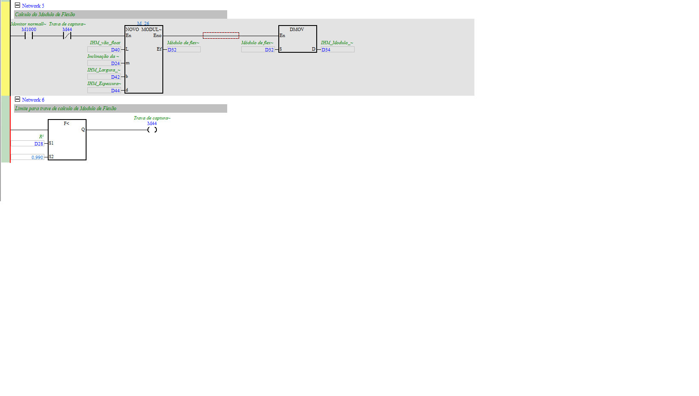

# MÓDULO_DE_FLEXÃO_PARCIAL (módulo por regressão linear)

| Campo | Valor |
|---|---|
| **POU no ISPSoft** | `MÓDULO_DE_FLEXÃO_PARCIAL` |
| **Tipo** | Program (LD) |
| **Depende de (FBs)** | SOMATORIAS, Regrassão_Linear_M, Coeficinete_de_correlação, NOVO_MODULO_DE_FLEXÃO |

## 🎯 O que faz
Calcula o **módulo de flexão** ajustando uma **reta** à parte inicial (elástica) da curva
força × deslocamento — via regressão linear — e **trava** o resultado quando o ajuste fica bom
(R² ≥ 0,990). É a forma "estatística" de achar a inclinação da região elástica.

## ⚙️ Como funciona
- **N1 — SOMATORIAS(X=`D600` deslocamento, Y=`D92` força)** → somatórias `D12`(ΣX), `D14`(ΣY),
  `D16`(ΣX²), `D18`(ΣY²), `D20`(ΣXY), `D22`(contador de pontos).
- **N2 — Regrassão_Linear_M** → inclinação `m` (`D24`).
- **N3 — Coeficinete_de_correlação** → `R²` (`D28`).
- **N4** — converte dimensões da IHM p/ float: vão `D438→D40`, largura `D436→D42`, espessura `D434→D44`.
- **N5 — NOVO_MODULO_DE_FLEXÃO(L=`D40`, m=`D24`, b=`D42`, d=`D44`)** → módulo `D32` → `D34` (IHM).
  Só roda enquanto `M44` (trava) está desligada.
- **N6** — `R² (D28) < 0,990` → `M44` (Trava de captura). Quando R²≥0,990, **congela o módulo**.

## 🔢 Variáveis / registradores
| Device | Nome | Tipo | R/W MES | Observação |
|--------|------|------|:-------:|------------|
| `D24` | Inclinação da curva (m) | REAL | R | slope da regressão |
| `D28` | R² (coef. correlação) | REAL | R | qualidade do ajuste |
| `D32`/`D34` | Módulo de flexão | REAL | R | resultado (trava em R²≥0,990) |
| `D12`–`D22` | somatórias | DWORD | — | intermediários |
| `M44` | Trava de captura | BIT | R | congela o módulo |

## 🖼️ Evidência

## ✅ Testes
| # | O que testar | Passos | Resultado esperado | Status |
|--:|--------------|--------|--------------------|:------:|
| 1 | Regressão converge | simular curva linear, ler `D28` | R²→~1,0 e `M44` trava | ⬜ |
| 2 | Módulo travado | após travar, variar entrada | `D32` não muda mais | ⬜ |

## 📝 Notas
- É aqui que ficam os FBs **SOMATORIAS / Regrassão_Linear_M / Coeficinete_de_correlação /
  NOVO_MODULO_DE_FLEXÃO**. As interfaces (entradas/saídas) estão acima; o **interior** (a fórmula)
  só é necessário se formos migrar o cálculo pro software.
