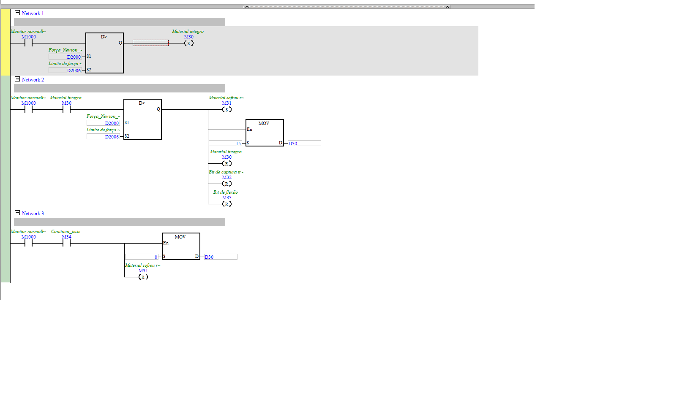

# Parada por Ruptura (detecção de rompimento)

| Campo | Valor |
|---|---|
| **POU no ISPSoft** | `Parada_Ruptura` |
| **Tipo** | Program (LD) |
| **Estado** | Ativo |
| **Depende de** | `Conversão_de_Unidades` (D2000), limite `D2006` |

## 🎯 O que faz
Detecta a **ruptura do corpo de prova** por queda de força: uma vez que o material foi carregado
acima de um limite, se a força **cair** abaixo desse limite → considera que rompeu, sinaliza e
manda parar o motor.

## ⚙️ Como funciona
- **N1:** `Força_Newton (D2000) > Limite de força (D2006)` → SET `Material integro` (M30).
- **N2:** com M30, se `Força_Newton (D2000) < Limite de força (D2006)` → SET `Material sofreu
  ruptura` (M31), `MOV 15 → D30` (código de estado), e RESET de M30, M32, M33.
- **N3:** `Continua_teste` (M34) → `MOV 0 → D30`, RESET M31.

`M31` alimenta o `CONTROL_MOTOR_PASSO` (Network 5) que **para o ensaio** ao romper.

## 🔢 Variáveis / registradores
| Device | Nome | Tipo | R/W MES | Observação |
|--------|------|------|:-------:|------------|
| `D2006` | Limite de força (ruptura) | REAL | **W** | limiar carga/ruptura |
| `D30` | código de estado | WORD | R | 15 = rompeu |
| `M30` | Material íntegro | BIT | R | carregado acima do limite |
| `M31` | Material sofreu ruptura | BIT | R | **evento de ruptura** |
| `M34` | Continua_teste | BIT | **W** | segue após ruptura |

## 🖼️ Evidência

## ✅ Testes
| # | O que testar | Passos | Resultado esperado | Status |
|--:|--------------|--------|--------------------|:------:|
| 1 | Detecta ruptura | subir força > `D2006`, depois derrubar | `M31=1`, `D30=15`, motor para | ⬜ |
| 2 | Continua teste | setar `M34` | `M31` reseta, `D30=0` | ⬜ |

## 📝 Notas
⚠️ Isto é detecção de ruptura **por software** (útil e correta pro ensaio). **Não substitui** a
emergência hardwired (X0) exigida por NR-12 — ver `control_motor_passo.md`.
