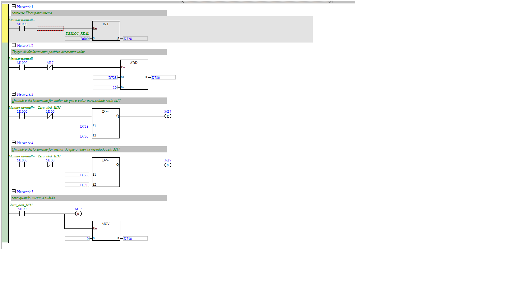

# Trygers (gatilho de captura de pontos da curva)

| Campo | Valor |
|---|---|
| **POU no ISPSoft** | `Trygers` (triggers) |
| **Tipo** | Program (LD) |
| **Estado** | Ativo |
| **Depende de** | `CONV_DISTAN_REAL` (D600) |

## 🎯 O que faz
Gera um **pulso (`M17`) a cada incremento de deslocamento** (~a cada 10 unidades), usado para
**amostrar pontos da curva** força × deslocamento em intervalos regulares.

## ⚙️ Como funciona
- N1: `INT DESLOC_REAL (D600) → D728` (float→int).
- N2: `ADD D728 + 10 → D730` (próximo alvo de amostragem).
- N3/N4: compara `D728` com `D730` (`D>=` reset / `D<=` set) → alterna `M17`.
- N5: ao zerar deslocamento (`M100`), RESET `M17` e `MOV 0 → D730`.

## 🔢 Variáveis / registradores
| Device | Nome | Tipo | R/W MES | Observação |
|--------|------|------|:-------:|------------|
| `D728` | deslocamento (inteiro) | DWORD | — | base do gatilho |
| `D730` | próximo alvo de amostra | DWORD | — | +10 a cada ponto |
| `M17` | trigger de captura | BIT | R | pulso por ponto da curva |

## 🖼️ Evidência

## ✅ Testes
| # | O que testar | Passos | Resultado esperado | Status |
|--:|--------------|--------|--------------------|:------:|
| 1 | Pulso por passo | avançar deslocamento, observar `M17` | pulsa a cada +10 | ⬜ |

## 📝 Notas
O passo de 10 define a resolução da curva capturada. Se o MES for construir a curva, pode usar
`M17` como gatilho ou simplesmente amostrar `D3000`/`D3010` no seu próprio período.
